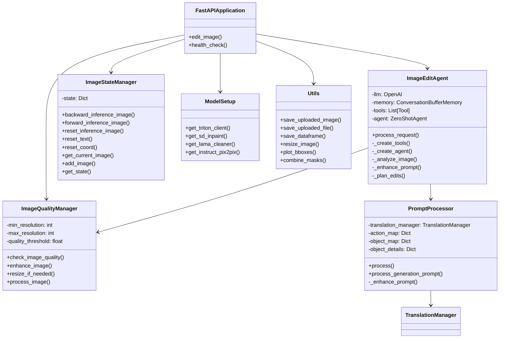
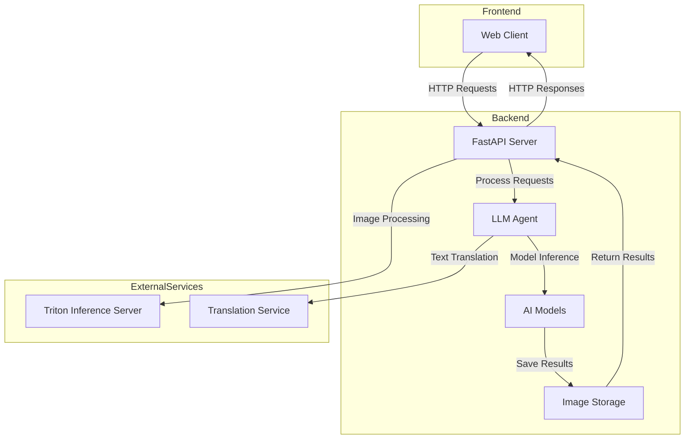

```mermaid
classDiagram
    class FastAPIApplication {
        +edit_image()
        +health_check()
    }

    class ImageEditAgent {
        -llm: OpenAI
        -memory: ConversationBufferMemory
        -tools: List[Tool]
        -agent: ZeroShotAgent
        +process_request()
        -_create_tools()
        -_create_agent()
        -_analyze_image()
        -_enhance_prompt()
        -_plan_edits()
    }

    class ImageStateManager {
        -state: Dict
        +backward_inference_image()
        +forward_inference_image()
        +reset_inference_image()
        +reset_text()
        +reset_coord()
        +get_current_image()
        +add_image()
        +get_state()
    }

    class ImageQualityManager {
        -min_resolution: int
        -max_resolution: int
        -quality_threshold: float
        +check_image_quality()
        +enhance_image()
        +resize_if_needed()
        +process_image()
    }

    class PromptProcessor {
        -translation_manager: TranslationManager
        -action_map: Dict
        -object_map: Dict
        -object_details: Dict
        +process()
        +process_generation_prompt()
        -_enhance_prompt()
    }

    class ModelSetup {
        +get_triton_client()
        +get_sd_inpaint()
        +get_lama_cleaner()
        +get_instruct_pix2pix()
    }

    class Utils {
        +save_uploaded_image()
        +save_uploaded_file()
        +save_dataframe()
        +resize_image()
        +plot_bboxes()
        +combine_masks()
    }

    FastAPIApplication --> ImageEditAgent
    FastAPIApplication --> ImageStateManager
    FastAPIApplication --> ImageQualityManager
    ImageEditAgent --> PromptProcessor
    ImageEditAgent --> ImageQualityManager
    FastAPIApplication --> ModelSetup
    FastAPIApplication --> Utils
    PromptProcessor --> TranslationManager
```

```mermaid
flowchart TB
    subgraph Frontend
        Client[Web Client]
    end

    subgraph Backend
        API[FastAPI Server]
        Agent[LLM Agent]
        Models[AI Models]
        Storage[Image Storage]
    end

    subgraph ExternalServices
        TritonServer[Triton Inference Server]
        TranslationService[Translation Service]
    end

    Client -->|HTTP Requests| API
    API -->|Process Requests| Agent
    Agent -->|Model Inference| Models
    API -->|Image Processing| TritonServer
    Agent -->|Text Translation| TranslationService
    Models -->|Save Results| Storage
    Storage -->|Return Results| API
    API -->|HTTP Responses| Client
```