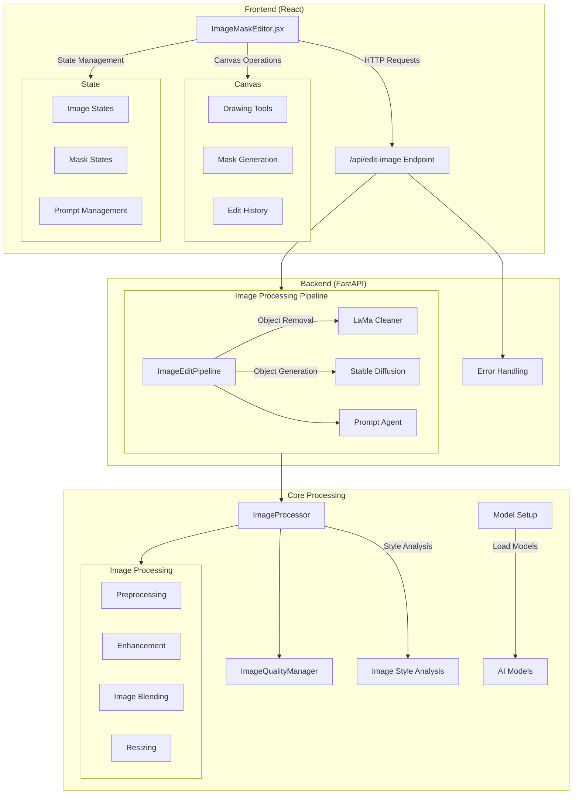

## 아키텍처


## Build 방법

### 가상환경 생성 및 활성화
```bash
    python3 -m venv venv
    # Windows
    venv\Scripts\activate
    # macOS/Linux
    source venv/bin/activate
```

### requirements.txt 설치
```bash
    pip install -r requirements.txt
```
<br>

## 로컬 테스트 환경 설정 가이드

### OpenAI API Key 발급

1. 아래 링크에서 OpenAI API Key를 발급받습니다:  
   [OpenAI API Key 발급 페이지](https://platform.openai.com/api-keys)

---

### 환경 변수 파일 생성 및 API Key 설정

1. 터미널에서 프로젝트 루트 디렉토리로 이동 후, 아래 명령어를 실행합니다:
   ```bash
   touch .env
   ```

2. 생성된 .env 파일을 열고 내용 추가:
   ```bash
   OPENAI_API_KEY='발급받은 키를 여기에 복사 붙여넣기'
   ```

----
### 실행
   ```bash
   python main.py
   npm start
   ```
